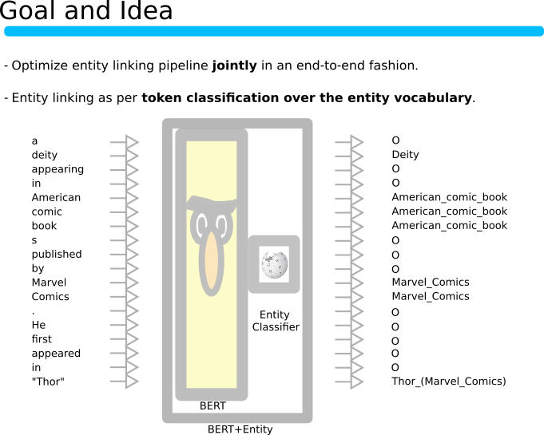

# "Investigating Entity Knowledge in BERT with Simple Neural End-To-End Entity Linking"  

This repository contains the code for the CONLL 2019 paper [**"Investigating Entity Knowledge in BERT with Simple Neural End-To-End Entity Linking"**](https://arxiv.org/abs/2003.05473). The code is provided as a documentation for the paper and also for follow-up research.

# <p align="center">  </p>

The content of this page covers the following topics: 

1. [Quick start](#quick-start)
2. [Preparation and Installation](#preparation-and-installation)
3. [Preprocessing of Wikipedia and the AIDA-CONLL entity linking benchmark into a sequence tagging format](#preprocessing-data)
4. [Finetuning/Training a BERT-Entity model on Wikipedia](#training)
5. [Finetuning a BERT-Entity model on the AIDA-CONLL entity linking benchmark](#training)
6. [Using a BERT-Entity model in a downstream task](#evalation-on-downstream-tasks)
7. [Issues and possible improvements](#issues-and-possible-improvements)

## Quick start

Here are all the steps until the finetuning and evaluation on the AIDA-CoNLL benchmark in a prototyping setting (i.e. a smaller model pretrained on reduced Wikipedia data):

- The project is installed as follows:

    ```
    git clone https://github.com/samuelbroscheit/entity_knowledge_in_bert.git
    cd entity_knowledge_in_bert
    pip install -r requirements.txt
    git submodule update --init
    ```

- Add paths to environment

    ```
    source setup_paths
    ```

- Create directory

    ```
    mkdir -p data/benchmarks/
    ```

    The AIDA-CoNLL benchmark file should be located under `data/benchmarks/aida-yago2-dataset/AIDA-YAGO2-dataset.tsv`. Get it from https://www.mpi-inf.mpg.de/departments/databases-and-information-systems/research/yago-naga/aida/downloads/ . If you get it from somewhere else, then please make sure that you have the correct file with 6 columns: Token, Mention, Yago Name, Wiki Name, Wiki Id, Freebase Id. 

- Run preprocessing

    ```
    python bert_entity/preprocess_all.py -c config/dummy__preprocess.yaml
    ```

- Run pretraining on Wikipedia

    ```
    python bert_entity/train.py -c config/dummy__train_on_wiki.yaml
    ```

- Finetune on AIDA-CoNLL benchmark

    ```
    python bert_entity/train.py -c config/dummy__train_on_aida_conll.yaml
    ```

- Evaluate the best model on the AIDA-CoNLL benchmark

    ```
    python bert_entity/train.py -c config/dummy__train_on_aida_conll.yaml --eval_on_test_only True --resume_from_checkpoint data/checkpoints/dummy_aidaconll_00001/best_f1-0.pt
    ```


## Preparation and Installation

For downloading and processing the full data and for storing checkpoints you should have at least 500GB of free space in the respective filesystem. If you just want to prototype there are also prepared configurations that need less space (~100GB).

### Installation

To install run the following commands:

```
git clone https://github.com/samuelbroscheit/entity_knowledge_in_bert.git
cd entity_knowledge_in_bert
pip install -r requirements.txt
git submodule update --init
```
### Setup Paths

**Every time** you run the code you have to setup up the paths for python with

```
source setup_paths
```

### Prepare AIDA CoNLL-YAGO2 benchmark data

First create the directory

```
mkdir -p data/benchmarks/
```

and then retrieve the AIDA CoNLL-YAGO2 benchmark from https://www.mpi-inf.mpg.de/departments/databases-and-information-systems/research/yago-naga/aida/downloads/ (the benchmark is referred to as AIDA Conll throughout the code). The resulting file should be located under `data/benchmarks/aida-yago2-dataset/AIDA-YAGO2-dataset.tsv`. If you get it from somewhere else, please make sure that you have the correct file with 6 columns: Token, Mention, Yago Name, Wiki Name, Wiki Id, Freebase Id. 


## Preprocessing data

1. [Run preprocessing](#run-preprocessing)
2. [Prepared configurations](#prepared-configurations)
3. [Available options](#available-options)
4. [Preprocessing tasks](#preprocessing-tasks)

### Run preprocessing

The preprocessing pipeline will take care of all downloads and processing of the data. You run the preprocessing with:

```  
python bert_entity/preprocess_all.py -c PREPROC_CONFIG_FILE_NAME
```  

PREPROC_CONFIG_FILE_NAME is a yaml file, but all options can also be given on the command line. 

### Prepared configurations

In the config folder you will find two configurations:

- [config/dummy__preprocess.yaml](config/dummy__preprocess.yaml) is a setting for prototyping and testing the preprocessing pipeline and for prototyping the BERT-Entity training.

- [config/conll2019__preprocess.yaml](config/conll2019__preprocess.yaml) is the setting "Setting 2" that was used in the the CoNLL 2019 paper for the BERT-Entity model with ~500K entities. 


### Available options
 
 The PREPROC_CONFIG_FILE_NAME supports the following configurations: 


```  

  --debug                       Print debug messages  

   # General settings

  --wiki_lang_version           Wiki language version, e.g. enwiki

  --data_version_name           Data identifier/version; e.g. if you experiment with different 
                                preprocessing options you should use different names here to create 
                                new directories. 

  --num_most_freq_entities      Number of most frequent entities that should be collected from the
                                entity set collected from the Wikipedia dump

  --add_missing_conll_entities  Whether entities for the AIDA CONLL benchmark that are missing from
                                the most frequent entities collected from the Wikipedia dump should
                                be added to the entity vocabulary

  --uncased                     Should the input token dictionary be uncased


   # DownloadWikiDump
   
  --download_data_only_dummy    Only download one wiki file

  --download_2017_enwiki        Download the enwiki 2017 dump to reproduce the experiments for the
                                CONLL 2019 paper


   # CollectMentionEntityCounts

  --collect_mention_entities_num_workers 
                                Number of worker for parallel processing of the Wikipedia dump to
                                collect mention entities.


   # WikiExtractor

  --wikiextractor_num_workers   Number of worker for parallel processing of the Wikipedia dump


   # CreateWikiTrainingData

  --create_training_data_num_workers 
                                Number of worker for parallel processing to create the sequence
                                tagging training data

  --create_training_data_num_entities_in_necessary_articles 
                                Threshold on the #entities in necessary articles (i.e. articles that 
                                contain entities in the most frequent entity vocabulary) that should 
                                be considered for training data
                                

   # CreateIntegerizedWikiTrainingData
                                
  --create_integerized_training_num_workers 
                                Number of worker for parallel processing to create the integerized 
                                sequence tagging training data, also determines the number of created
                                shards.
                                
  --create_integerized_training_instance_text_length 
                                Text length of the integerized training instances
                                
  --create_integerized_training_instance_text_overlap 
                                Overlap between integerized training instances

  --create_integerized_training_max_entity_per_shard_count 
                                Max count per entity in each shard. For each 
    
  --create_integerized_training_valid_size 
                                Sample size for validation data.

  --create_integerized_training_test_size 
                                Sample size for test data.


```  

### Preprocessing tasks

Preprocessing consists of the following tasks (the respective code is in `bert_entity/preprocessing`):

- CreateRedirects
  - Create a dictionary containing redirects for Wikipedia page names [(*)](#footnote). The redirects are used for the Wikipedia mention extractions as well as for the AIDA-CONLL benchmark. 
  
      ```  
      "AccessibleComputing": "Computer_accessibility"
      ```
    
- CreateResolveToWikiNameDicts
    - Create a dictionary that map Freebase Ids and Wikipedia pages ids to Wikipedia page names [(*)](#footnote). The disambiguations are used to detect entity annotations in the AIDA-CONLL benchmark that have become incompatible for newer Wikipedia versions.

      ```  
      "/m/01009ly3": "Dysdera_ancora"
      ```

      ```  
      "10": "Computer_accessibility"
      ```

- CreateDisambiguationDict
    - Create a dictionary containing disambiguations for Wikipedia page names [(*)](#footnote). The disambiguations are used to detect entity annotations in
    the AIDA-CONLL benchmark that have become incompatble for newer Wikipedia
    versions.

      ```  
      "Alien": ["Alien_(law)", "Alien_(software)", ... ] 
      ```

- DownloadWikiDump
    - Download the current Wikipedia dump. Either download one file for a dummy / prototyping version. Set `download_data_only_dummy` to True for just one file, ootherwise download all files. Set `download_2017_enwiki` to True if not the latest dump should be retrieved but a 2017 dump like in the paper. 
    
- Wikiextractor
    - Run Wikiextractor on the Wikipedia dump and extract all the mentions from it.
    
- CollectMentionEntityCounts
    - Collect mention entity counts from the Wikiextractor files.

- PostProcessMentionEntityCounts
    - Create entity indexes that will later be used in the creation of the Wikipedia training data. First, based on the configuration key `num_most_freq_entities` the **top k most popular entities** are selected. Based on those, other mappings are created to only
    contain counts and priors concerning the top k popular entities. Later the top k popular entities will also restrict the training  data to only contain instances that contain popular entities.
    Also, if `add_missing_conll_entities` is set, the entity ids necessary for the AIDA-CONLL benchmark that are missing in the top k popular entities are added. This is to ensure that the evaluation measures are comparable to prior work. 
    
- CreateAIDACONLL
    - Read the AIDA-CONLL benchmark dataset in and merge it with the NER annotations. Requires you to provide `data/benchmarks/aida-yago2-dataset/AIDA-YAGO2-dataset.tsv`. Please make sure that you have the correct file with 6 columns: Token, Mention, Yago Name, Wiki Name, Wiki Id, Freebase Id. 
    
- CreateKeywordProcessor
    - Create a tri-based matcher to detect possible mentions of our known entities. We use this later to add autmatic annotations to the text. However, as we do not know the true entity for those mentions, they will have multiple labels, i.e. all entities from the p(e|m) prior.

- CreateWikiTrainingData
    - Create sequence labelling data. Tokenization is done with BertTokenizer. Tokens are either have a label when they have an associated Wikipedia link, or when they are in spans detected by the keyword matcher. Subsequently, we count the mentions in this data and create a discounted prior p(e|m) and the set of necessary Wikpedia articles, i.e. all the articles that contain links to the top k popular entities.

- CreateIntegerizedWikiTrainingData
    - Create overlapping chunks of the Wikipedia articles. Outputs are stored as Python lists with integer ids. Configured by `create_integerized_training_instance_text_length` 
    and `create_integerized_training_instance_text_overlap`.

        Each worker creates his own shard, i.e., the number of shards is determined by `create_integerized_training_num_workers`.

        Only saves a training instance (a chunk of a Wikipedia article) if at least one entity in that chunk has not been seen more than `create_integerized_training_max_entity_per_shard_count` times. This downsamples highly frequent entities. Has to be set in relation to `create_integerized_training_num_workers`
         and `num_most_freq_entities`. For the CONLL 2019 paper experiments the setting was

        ```
        create_integerized_training_max_entity_per_shard_count = 10
        create_integerized_training_num_workers = 50
        num_most_freq_entities = 500000
        ```
        
- CreateIntegerizedCONLLTrainingData
    - Create overlapping chunks of the benchmark articles. Outputs are stored as Python lists with integer ids. Configured by `create_integerized_training_instance_text_length` 
    and `create_integerized_training_instance_text_overlap`.

###### Footnote 
_Here we use an already extracted mapping provided by DBPedia that was created from a 2016 dump. Please note that in the experiments for the paper a Wikipedia dump from 2017 was used. The DbPedia dictionaries might not  be adequate for the latest wiki dumps._


## Training

Once you have alle the preprocessing done, you can run the training on Wikipidia to learn a BERT-Entity model. When you have learned a BERT-Entity model on Wikipedia you can resume it to finetune it on the AIDA-CONLL benchmark. 

1. [Run training](#run-training)
2. [Prepared configurations](#prepared-configurations)
3. [Available options](#available-options)

### Run training

Run the training with:

```  
python bert_entity/train.py -c TRAIN_CONFIG_FILE_NAME 
```  

TRAIN_CONFIG_FILE_NAME is a yaml file, but all options can also be given on the command line. 


### Run evaluation

Run evaluation with:

```  
python bert_entity/train.py -c TRAIN_CONFIG_FILE_NAME  --eval_on_test_only True --resume_from_checkpoint LOGDIR/best_f1-0.pt
```  

LOGDIR is the path that was set in TRAIN_CONFIG_FILE_NAME with key `logdir` . 

### Prepared configurations

In the config folder you will find the following configurations:

- [config/dummy__train_on_wiki.yaml](config/dummy__train_on_wiki.yaml) is a setting for prototyping the BERT-Entity training on Wikipieda.

- [config/dummy__train_on_aida_conll.yaml](config/dummy__train_on_aida_conll.yaml) is a setting to finetune the best found model from `dummy__train_on_wiki.yaml` on the the aida-yago2 dataset.

- [config/conll2019__train_on_wiki.yaml](config/dummy__train_on_wiki.yaml) is a setting for reproducing the BERT-Entity training on Wikipieda from the CoNLL 2019 paper.

- [config/conll2019__train_on_aida_conll.yaml](config/dummy__train_on_aida_conll.yaml) is a setting to finetune the best found model from `conll2019__train_on_wiki.yaml` on the the aida-yago2 dataset to reproduce the CoNLL 2019 paper.


### Available options
 
 The TRAIN_CONFIG_FILE_NAME supports the following configurations: 

```
  --debug                               DEBUG

  --logdir                              LOGDIR; the output dir where checkpints and logfiles are stored

  --data_workers                        number of data workers to prepare training instances

  --data_version_name                   use the same identifier that was used for the same key in 
                                        preprocessing


  --device                              GPU device used for training
  --eval_device                         GPU device used for evaluation
  --out_device                          GPU device used to collect the most probable entities in the batch 

  --dataset                             'EDLDataset' for training on Wikipedia or 'CONLLEDLDataset' 
                                        for training on AIDA-CONLL

  --model                               Either 'Net' for training on Wikipedia or 'ConllNet' for 
                                        training on AIDA-CONLL

  --eval_on_test_only                   only run evaluation on test (requires --resume_from_checkpoint)

  --batch_size                          batch size in training
  --eval_batch_size                     batch size in evluation
  --accumulate_batch_gradients          accumulate gradients over this many batches

  --n_epochs                            max number of epochs
  --finetuning                          start finetuning after this many epochs
  --checkpoint_eval_steps               evaluate every this many epochs
  --checkpoint_save_steps               save a checkpoint every this many epochs
  --dont_save_checkpoints               dont_save_checkpoints               

  --sparse                              Use a sparse embedding layer

  --encoder_lr                          encoder learning rate
  --decoder_lr                          decoder learning rate
  --encoder_weight_decay                encoder weight decay
  --decoder_weight_decay                decoder weight decay
  --bert_dropout                        BERT_DROPOUT

  --label_size                          nr of entities considered in the label vector for each instance
  --topk_neg_examples                   TOPK_NEG_EXAMPLES
  --entity_embedding_size               entity_embedding_size               
  --project                             project entity embedding

  --resume_from_checkpoint              path of checkpoint to resume from 
  --resume_reset_epoch                  reset the epochs from the checkpoint for resuming (f.ex.
                                        training on AIDA-CONLL)
  --resume_optimizer_from_checkpoint    resume optimizer from checkpoint

  --eval_before_training                evluate once before training
  --data_path_conll                     path to the conll file that was create in data_version_name
  --exclude_parameter_names_regex       regex to exclude params from training, i.e. freeze them
```


## Evalation on downstream tasks

See files in `downstream_tasks`. Documentation is a TODO.

## Issues and possible improvements

- The code is currently poorly documented and not always nice to read. 
- Currently all checkpoints are kept which requires a lot of disk space, should be configurable to only keep the K most current checkpoints. 
- Training is slow because of accumulating the most probable entities per batch. This could be sped up with adaptive softmax like change, i.e. first decide if token is an entity. 
- Resuming currently only works on the epoch level. To enable resuming in between epochs, the shuffled indexes for an epoch have to be stored in the LOGDIR or checkpoint.
- When AIDA CoNLL entities are missing from the top k popular entities and are added to the vocabulary, should make sure that confounders with high BPE token overlap are added as well. 
- Configuration to create integerized Wiki training data is hard to grasp, i.e. which training instances are included depends on `create_integerized_training_max_entity_per_shard_count`, `create_integerized_training_num_workers` and `num_most_freq_entities`. Their influence is difficult to describe, should be more straightforward.
- It would be much better to produce an annotated document and evaluate it with https://github.com/wikilinks/neleval . neleval is widely used and has all the necessary metrics implemented. 
- Investigate shrinking the model size and improve prediction speed. 

## Citation

if you find this code useful for your research please cite 

```
@inproceedings{broscheit-2019-investigating,
    title = "Investigating Entity Knowledge in {BERT} with Simple Neural End-To-End Entity Linking",
    author = "Broscheit, Samuel",
    booktitle = "Proceedings of the 23rd Conference on Computational Natural Language Learning (CoNLL)",
    month = nov,
    year = "2019",
    address = "Hong Kong, China",
    publisher = "Association for Computational Linguistics",
    url = "https://www.aclweb.org/anthology/K19-1063",
    doi = "10.18653/v1/K19-1063",
    pages = "677--685",
}
```
